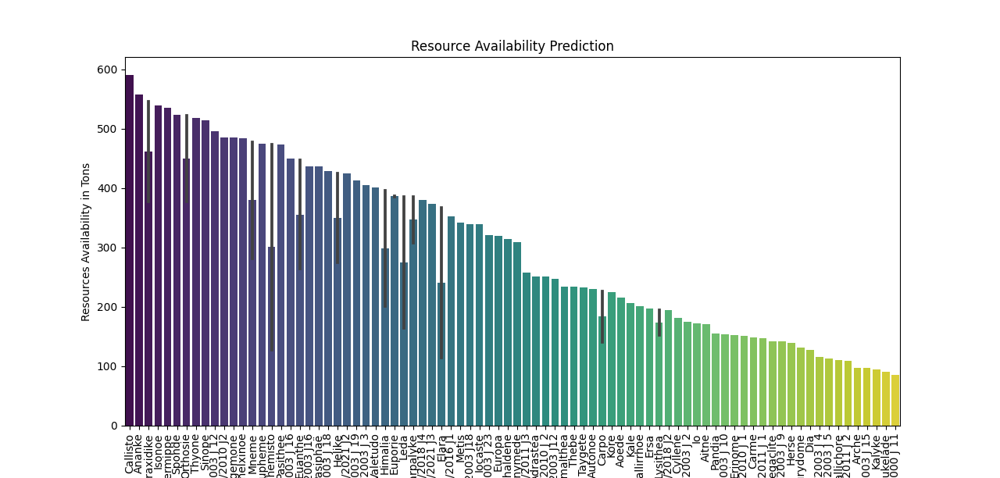
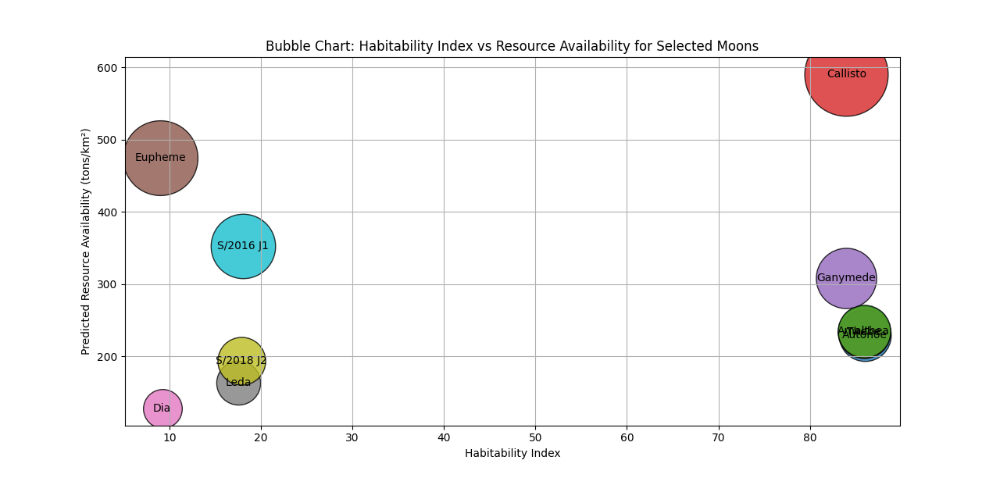
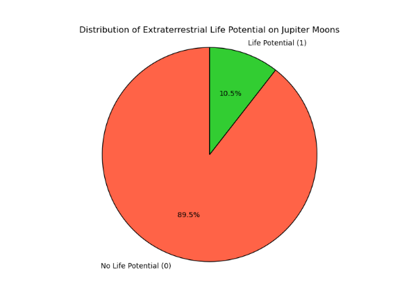
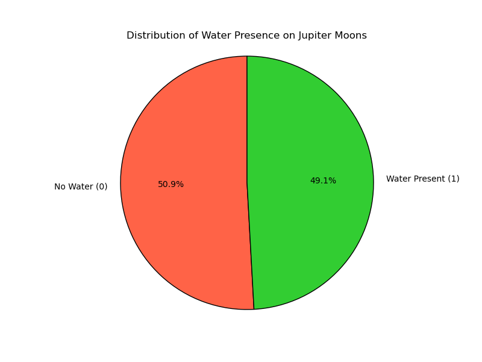
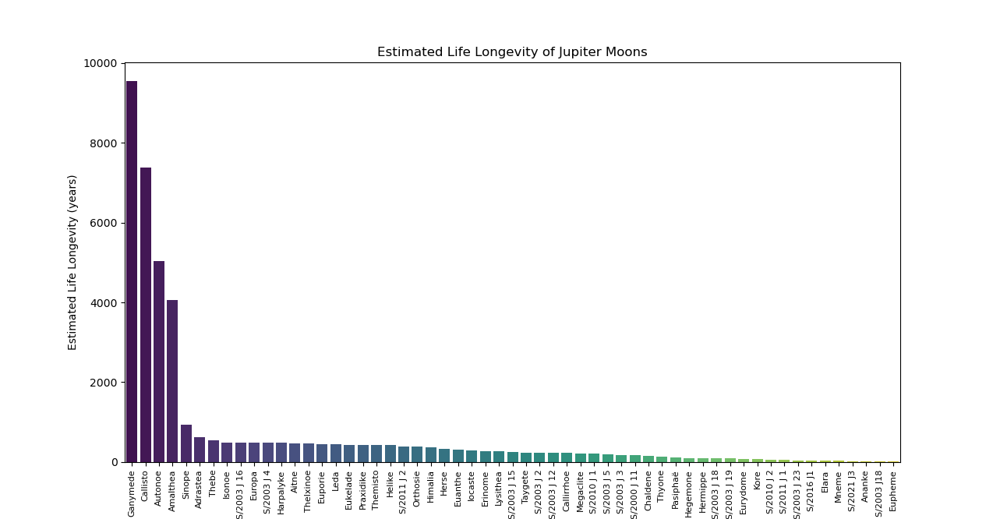

<h1>Predictive Modeling of Resource Utilization and Extraterrestrial Life Potential on Jupiter’s Moons</h1>

 

A comprehensive AI-driven research project that predicts resource availability, sustainable extraction potential, and extraterrestrial life probability on Jupiter’s moons using machine learning and deep learning techniques.

 

 

<h2>Table of Contents</h2>

 

<ol>
<li>Project Overview</li>
<li>Research Objectives</li>
<li>Significance of the Study</li>
<li>Dataset Description</li>
<li>Methodology</li>
<li>Machine Learning Models</li>
<li>Visualizations and Results</li>
<li>Project Structure</li>
<li>Installation</li>
<li>Usage</li>
<li>Future Scope</li>
<li>Limitations</li>
<li>References</li>
</ol>

 

<h2>Project Overview</h2>

 

Jupiter’s moons are among the most scientifically intriguing celestial bodies in the solar system. Several moons such as <b>Europa, Ganymede, and Callisto</b> exhibit conditions that suggest the presence of valuable resources and possibly environments capable of supporting extraterrestrial life.

This project develops an <b>AI-driven predictive framework</b> that analyzes environmental and geological parameters of Jupiter’s moons to estimate:

<table>
<tr>
<th>Research Goal</th>
<th>Description</th>
</tr>
<tr>
<td>Resource Availability</td>
<td>Predict extractable resources such as water ice, minerals, and gases</td>
</tr>
<tr>
<td>Sustainable Extraction</td>
<td>Estimate years resources can be extracted without depletion</td>
</tr>
<tr>
<td>Habitability Assessment</td>
<td>Predict probability of microbial or complex life</td>
</tr>
<tr>
<td>Exploration Planning</td>
<td>Identify optimal moons for future missions</td>
</tr>
</table>

The study integrates <b>planetary science, astrobiology, and machine learning</b> to assist future space exploration missions.

 

<h2>Research Objectives</h2>

 

<h3>1. Resource Prediction</h3>

<ul>
<li>Estimate the availability of water ice, minerals, and atmospheric gases</li>
<li>Predict sustainable extraction rates</li>
</ul>

<h3>2. Habitability Analysis</h3>

<ul>
<li>Identify potential biosignatures</li>
<li>Predict survival probabilities of microbial life</li>
</ul>

<h3>3. Moon Classification</h3>

<ul>
<li>Classify moons based on surface composition</li>
<li>Compare icy and rocky moons</li>
</ul>

<h3>4. Exploration Planning</h3>

<ul>
<li>Identify high priority moons for exploration</li>
<li>Balance mining feasibility and environmental sustainability</li>
</ul>

<h3>5. AI-driven Analysis</h3>

<ul>
<li>Apply machine learning models to planetary datasets</li>
<li>Build predictive frameworks for space exploration research</li>
</ul>

 

<h2>Significance of the Study</h2>

 

<table>
<tr>
<th>Domain</th>
<th>Contribution</th>
</tr>
<tr>
<td>Space Exploration</td>
<td>Identifies moons suitable for future missions</td>
</tr>
<tr>
<td>Astrobiology</td>
<td>Evaluates potential extraterrestrial life conditions</td>
</tr>
<tr>
<td>Resource Utilization</td>
<td>Predicts sustainable off-earth mining strategies</td>
</tr>
<tr>
<td>Space Colonization</td>
<td>Provides insights for future human settlement</td>
</tr>
</table>

 
 

<h2>Tech Stack</h2>

 

 

<h2>Machine Learning Pipeline</h2>

 

<ol>
<li>Data Collection from NASA datasets, scientific publications, and simulated extrapolations</li>
<li>Data Preprocessing and Feature Engineering (handling missing values, standardization, SMOTE)</li>
<li>Training Regression Models for Resource Availability Prediction</li>
<li>Training Classification Models for Habitability / Life Probability Prediction</li>
<li>Deep Learning ANN Model for Habitability Prediction</li>
<li>Time Series Forecasting (ARIMA) for Resource Sustainability</li>
<li>Evaluation of Model Performance</li>
<li>Generating Visualizations and Analytical Reports</li>
</ol>

<h2>Dataset Description</h2>

 

The dataset used in this project was <b>self-constructed</b> by integrating multiple sources.

<h3>Data Sources</h3>

<table>
<tr>
<th>Source</th>
<th>Data Type</th>
</tr>
<tr>
<td>NASA Open Data</td>
<td>Gravity, radiation, temperature</td>
</tr>
<tr>
<td>Scientific Publications</td>
<td>Habitability metrics</td>
</tr>
<tr>
<td>Simulated Data</td>
<td>Resource estimates and biosignatures</td>
</tr>
</table>

 

<h2>Methodology</h2>

 

<h3>1. Data Collection and Preprocessing</h3>

<ul>
<li>Data collected from NASA archives and scientific literature</li>
<li>Missing values filled using statistical simulations</li>
<li>Features standardized for consistency</li>
<li>SMOTE used to handle class imbalance</li>
</ul>

<h3>2. Machine Learning Models</h3>

<table>
<tr>
<th>Model Type</th>
<th>Purpose</th>
</tr>
<tr>
<td>Regression</td>
<td>Predict resource availability</td>
</tr>
<tr>
<td>Classification</td>
<td>Predict life probability</td>
</tr>
</table>

 

<h2>Visualizations and Results</h2>

 

<h3>Resource Availability</h3>

<h3>Habitability vs Resource Analysis</h3>

<h3>Probability of Extraterrestrial Life</h3>

<h3>Water Distribution</h3>

<h3>Estimated Life Longevity</h3>

 

<h2>Project Structure</h2>

 

<pre>
jovian-resources-and-habitability-analysis

├── analysis/
├── data/
├── evaluation/
├── forecasting/
├── models/
├── outputs/
├── preprocessing/
├── utils/
├── visualization/

├── jupiter_moons_dataset_aic.csv
├── main.py
├── requirements.txt
├── LICENSE
└── README.md
</pre>

 

<h2>Installation</h2>

 

<pre>
git clone https://github.com/yourusername/jovian-resources-and-habitability-analysis.git
cd jovian-resources-and-habitability-analysis
pip install -r requirements.txt
</pre>

 

<h2>Usage</h2>

 

<pre>
python main.py
</pre>

<ul>
<li>Dataset preprocessing</li>
<li>Machine learning training</li>
<li>Habitability prediction</li>
<li>Resource availability forecasting</li>
<li>Visualization generation</li>
</ul>

All generated graphs are saved inside the <b>outputs</b> folder.

 

<h2>Future Scope</h2>

 

<ul>
<li>Integration with real mission datasets from Europa Clipper</li>
<li>Reinforcement learning for autonomous space mining</li>
<li>Geospatial AI models for landing site optimization</li>
<li>Expansion to Saturn’s moons such as Titan and Enceladus</li>
</ul>

 

<h2>Limitations</h2>

 

<table>
<tr>
<th>Limitation</th>
<th>Description</th>
</tr>
<tr>
<td>Limited Observational Data</td>
<td>Direct measurements of Jupiter’s moons remain scarce</td>
</tr>
<tr>
<td>Simulated Dataset Components</td>
<td>Some parameters are estimated through scientific extrapolation</td>
</tr>
<tr>
<td>Model Uncertainty</td>
<td>Predictions depend heavily on dataset quality</td>
</tr>
<tr>
<td>Environmental Variability</td>
<td>Radiation exposure and geological changes may alter predictions</td>
</tr>
</table>

 

<h2>References</h2>

 

NASA Science – Jupiter’s Moons 
https://science.nasa.gov/jupiter/moons

NASA Data Catalog 
https://catalog.data.gov

JUICE Mission Research 
https://www.sciencedirect.com/science/article/pii/S0032063312003777

Moons of Jupiter 
https://en.wikipedia.org/wiki/Moons_of_Jupiter

Grasset et al. (2013) 
JUpiter ICy moons Explorer (JUICE)

 

<b>Research Project by Hamayl Zahid</b>

BS Artificial Intelligence

